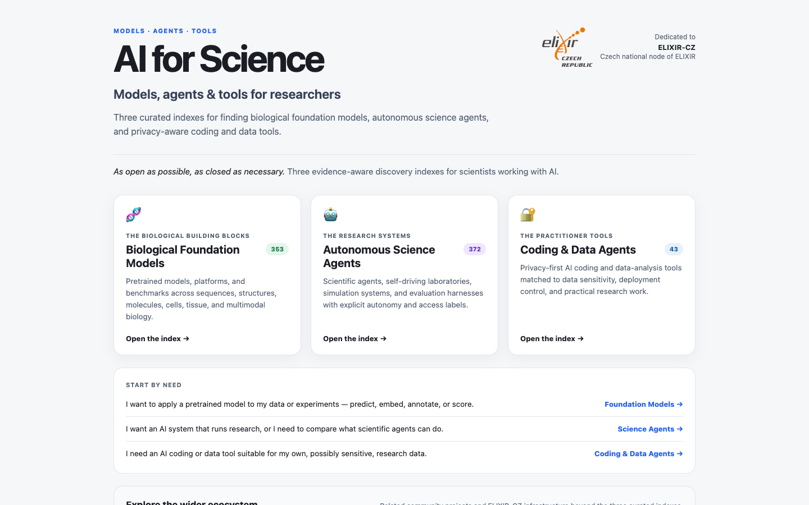

# AI for Science

A curated entry point to three researcher-oriented indexes of biological foundation models, autonomous science agents, and AI coding or data tools. The collection is designed for practical discovery while keeping provenance, evidence dates, data sensitivity, and machine-readable access visible.

**[Open the collection](https://michalie.github.io/)**

## Explore the indexes

| Index | Research question | Open |
| --- | --- | --- |
| Biological Foundation Models | Which models may fit my biological modality and task? | [Explore](https://michalie.github.io/bio-foundation-models-wiki/) |
| Autonomous Science Agents | Which agentic systems or benchmarks exist for my workflow? | [Explore](https://michalie.github.io/autonomous-stem-agents-wiki/) |
| AI Coding and Data Agents | Which tools fit my data sensitivity and operating constraints? | [Explore](https://michalie.github.io/research-coding-agents-wiki/) |

Each index links to its papers, code, services, source catalog, schema, JSON-LD metadata, evidence, licences, and reproducible maintenance instructions.

## FAIR-oriented access

The collection supports findability, accessibility, interoperability, and reuse through persistent public identifiers, structured metadata, open formats, explicit licences, provenance, versioning, and synchronized human- and machine-readable distributions.

- [Collection catalog](https://michalie.github.io/catalog.json)
- [Collection JSON Schema](https://michalie.github.io/catalog.schema.json)
- [Collection JSON-LD metadata](https://michalie.github.io/metadata.jsonld)
- [Versioned child-catalog lock](child_catalogs.lock.json)
- [Maintenance and release protocol](PORTAL_MAINTENANCE.md)

FAIR is treated as an ongoing stewardship practice. It does not certify the scientific validity, security, legal suitability, or availability of an indexed external resource.

## ELIXIR-CZ community resources

- [Alphafoldology](https://karelberka.github.io/Alphafoldology/) — explore the genealogy and downstream evolution of AI protein-folding tools; [source repository](https://github.com/KarelBerka/alphafoldology).
- [ELIXIR-CZ services](https://www.elixir-czech.cz/services) — research infrastructure services available through the Czech ELIXIR node.

These companion links provide community context and are not catalog records or endorsements.

## Stewardship and licences

Curated and published by **Michaela Liegertová** ([michaela.liegertova@img.cas.cz](mailto:michaela.liegertova@img.cas.cz)), affiliated with the [Institute of Molecular Genetics of the Czech Academy of Sciences](https://www.img.cas.cz/en/). Dedicated to the [ELIXIR-CZ](https://www.elixir-czech.cz/) community.

IMG affiliation and the ELIXIR-CZ dedication provide context; they do not imply institutional publication authority or endorsement.

Collection metadata and original documentation are licensed under [CC BY 4.0](LICENSE-CONTENT.md). Portal maintenance and validation software are licensed under the [MIT License](LICENSE-CODE). External resources, logos, and trademarks retain their own terms.

See [`CHANGELOG.md`](CHANGELOG.md) for version history.
